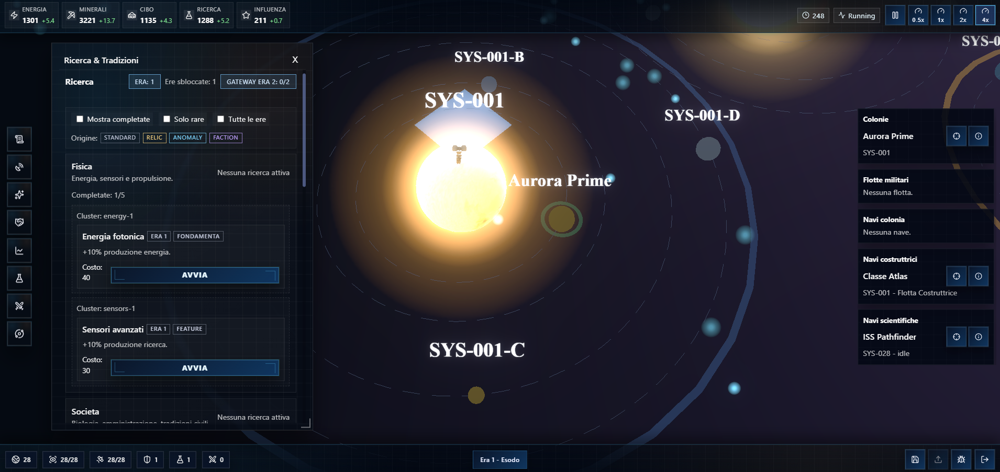

# 🌌 fls-node-epicronicles

[](https://vitejs.dev/)
[](https://react.dev/)
[](https://threejs.org/)
[](https://www.typescriptlang.org/)
[](LICENSE)

A management-focused space sim with a 3D galaxy map, Three.js renderer, and a Redux Toolkit game state. The project ships with a dockable HUD, modular panels, and generative assets (nebulae, starfield, black hole).



## ✨ Features
- 🌌 **Procedural galaxy** — circle/spiral seeds, animated star shaders, nebula layers, central black hole.
- 🪐 **Living systems** — orbiting planets with labels, colonization markers, science/fleet anchors, combat flags.
- 🎥 **Cinematic camera** — custom tilt/zoom/pan, bloom post-process, zoom-aware LOD for rings/labels.
- 🧭 **4X gameplay** — exploration & fog-of-war, fleets/battles, colonies/economy, research/traditions, diplomacy/war.
- 🧰 **Deterministic state** — Redux Toolkit slices/thunks/selectors, config presets, seeded sessions.
- 🧩 **Modular UI** — dockable HUD, panels/windows, scoped Sass styling.

## 🚀 Quickstart
Requires Node 18+ and npm.

```bash
npm install
npm run dev       # start in dev mode
npm run build     # production build (tsc + vite)
npm run preview   # preview the build
```

## 📂 Structure
- `src/engines` — domain logic (galaxy, fleet, research, economy, diplomacy).
- `src/ui` — React views, HUD, dock, panels, and the 3D GalaxyMap.
- `src/shared/three` — materials, scene setup, and graphics helpers.
- `src/config` — game presets and shared configuration.
- `src/store` — Redux store, slices, selectors, and thunks.

## 🧭 Galaxy Map (Three.js)
- Custom shaders for star cores (`starCoreMaterial.ts`) and visual layers (`starVisual.ts`).
- Scene rebuild pipeline (`lib/rebuild`) for systems, fleets, and science anchors.
- Per-frame updates (`lib/frame`) for camera, effects, and star animations.

## 🛠️ Stack
- Vite + React 19 + TypeScript 5.9
- Three.js for 3D rendering
- Redux Toolkit for app state
- Sass for modular styling

## 📜 License
Distributed under the [MIT](LICENSE) license.
